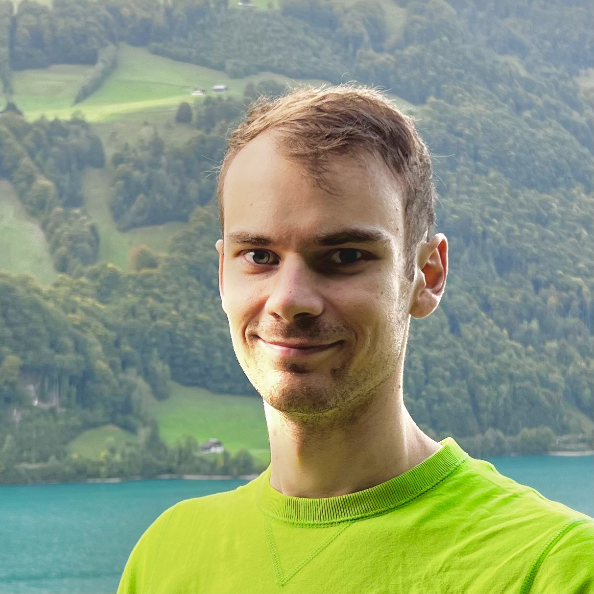

Lukas Strobel is a researcher at the Institute for Anthropomatics and Robotics at the Karlsruhe Institute of Technology (KIT). He holds a Master's degree in Computer Science from Saarland University. His research focuses on Human-Computer Interaction, accessibility and sport.
